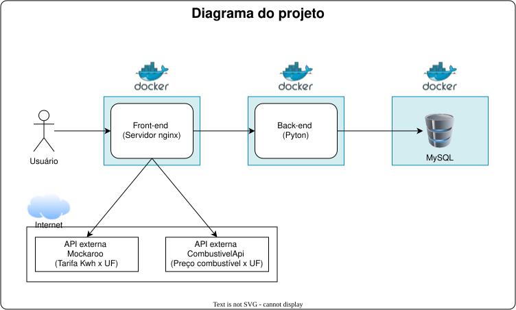

# PetroWatts

Este é um MVP que será apresentado como Trabalho de Conclusão de Curso (TCC) da Pós-graduação da PUC-Rio.

Inicialmente explicarei um pouco sobre o funcionamento do app e a proposta do projeto de maneira bem resumida, pois o objetivo aqui é apresentar uma breve introdução.

Em seguida deixarei notas sobre o funcionamento e configuração do ambiente, nada além do esperado para esta primeira sprint.

Na sequência apresento um plano de desenvolvimento.

## Sobre o sistema

O objetivo do sistema é apresentar ao usuário de maneira clara e intuitiva os custos necessários e a possível economia na troca de seu veículo a combustão por um elétrico, assim como o tempo que levará para que o investimento inicial seja "recuperado".

Para isso haverá um cadastro do usuário e seu estado de residência e, em seguida, o cadastro do seu carro a combustão com os seguintes dados:

* Marca
* Modelo
* Ano
* Consumo médio (km/l)
* Rodagem usual mensal

A partir dos dados preenchidos, o sistema poderá calcular e exibir:

* Valor estimado de investimento para a troca por um veículo elétrico
* Economia gerada em combustível
* Impacto de gastos na conta de luz
* Redução de emissões de carbono
* Tempo estimado para recuperação do investimento inicial (payback)

Para o correto funcionamento das funcionalidades acima, serão necessário o manuseio dos seguintes dados:

* usuário
* carro possuído por usuário
* carro à combustão (marca, modelo, ano, consumo, imagem, valor revenda FIPE)
* carro elétricos (marca, modelo, valor compra, consumo)
* dados de preços do Kwh (Região, preço Kwh)

### Tecnologias Utilizadas

* **Frontend:** HTML, Bootstrap, CSS e Flask
* **Backend:** Python e MySQL 8.0 (em container próprio e populado via scripts de carga inicial na pasta initdb/)
* **Documentação:** Swagger para documentar as APIs

#### Schema do Banco de Dados

* [Diagrama (Mermaid)](banco-dados/petrowatts-diagrama-bd.md)

#### Arquitetura do projeto



## Execução da Aplicação (Docker)

Toda a infraestrutura do projeto está containerizada via Docker Compose.

### Pré-requisitos

Docker Desktop instalado e em execução.

### Executar o projeto completo

1. Clone os repositórios referentes ao backend (`petrowatts`) e ao frontend (`petrowatts-frontend`), sendo de suma importância que a pasta raiz desses projetos estejam compartilhando o mesmo diretório da sua máquina, e estejam no mesmo nível diretorial

    ```cmd
    git clone <URL_DO_REPOSITORIO_PETROWATTS>
    git clone <URL_DO_REPOSITORIO_PETROWATTS_FRONTEND>
    ```

2. Acesse o frontend (`petrowatts-frontend`) e suba os containers preparados via docker compose, são eles: banco de dados MySQL, o servidor web Nginx e do backend API Python:

    ```bash
    cd petrowatts-frontend
    docker compose up --build -d
    ```

    *Nota: Na primeira execução, o banco MySQL será criado e populado automaticamente com os dados de carga inicial.*

3. Acesse a aplicação:

   * Backend API / Documentação Interativa (Swagger): <http://localhost:5000/openapi>
   * Aplicação Web: <http://localhost:8080>

4. Para parar os containers:

    ```bash
    docker compose down
    ```

## Plano de desenvolvimento

### Primeira Sprint (Fullstack Básico) - Entregue (1.0)

* home html, com css e js
* cadastro de usuário
* cadatro de carro a combustão
* carga inicial de dados no BD

### Segunda Sprint (Back-end Avançado) - Em desenvolvimento

* Conteinerização do backend e BD
* Migração de armazenamento para banco de dados MySQL com scripts de carga automática
  * adição de imagens (blob)
* Integração com a API pública da ANEEL para obtenção da tarifa oficial por UF
* Motor de cálculo de consumo e comparativo financeiro entre elétrico e combustão

### Terceira Sprint - Não iniciado

* À definir;
