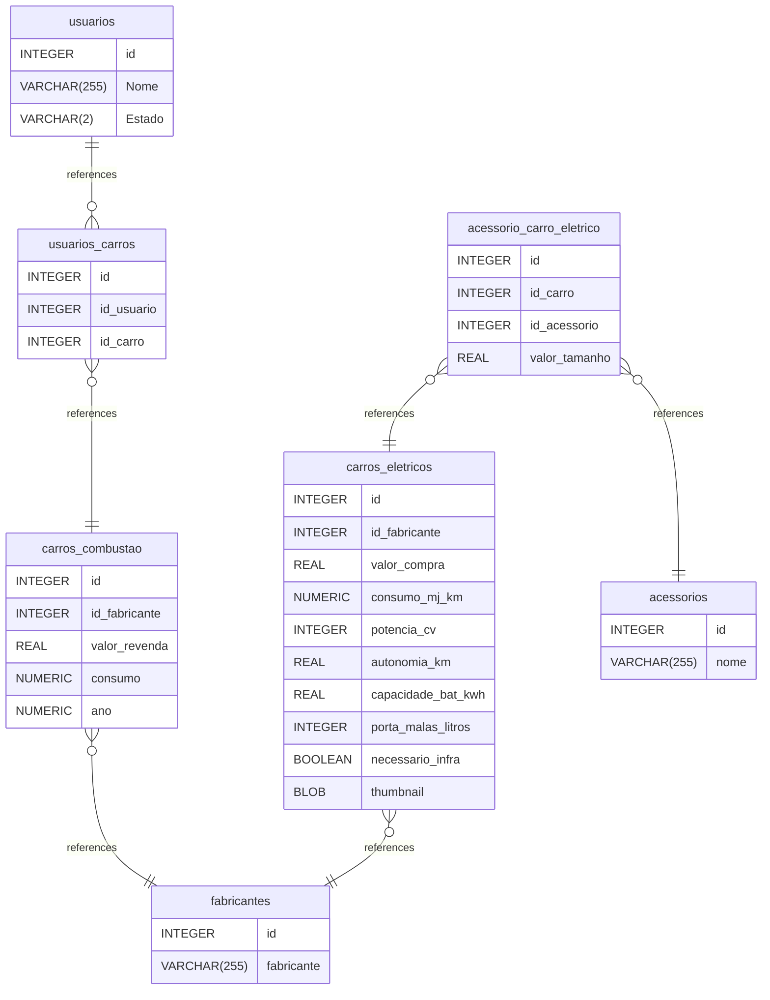

```mermaid
erDiagram
  carros_combustao }o--|| fabricantes : references
  carros_eletricos }o--|| fabricantes : references
  usuarios_carros }o--|| carros_combustao : references
  usuarios ||--o{ usuarios_carros : references
  acessorio_carro_eletrico }o--|| acessorios : references
  acessorio_carro_eletrico }o--|| carros_eletricos : references

  usuarios {
    INTEGER id
    VARCHAR(255) Nome
    VARCHAR(2) Estado
  }

  usuarios_carros {
    INTEGER id
    INTEGER id_usuario
    INTEGER id_carro
  }

  fabricantes {
    INTEGER id
    VARCHAR(255) fabricante
  }

  carros_eletricos {
    INTEGER id
    INTEGER id_fabricante
    REAL valor_compra
    NUMERIC consumo_mj_km
    INTEGER potencia_cv
    REAL autonomia_km
    REAL capacidade_bat_kwh
    INTEGER porta_malas_litros
    BOOLEAN necessario_infra
    BLOB thumbnail
  }

  carros_combustao {
    INTEGER id
    INTEGER id_fabricante
    REAL valor_revenda
    NUMERIC consumo
    NUMERIC ano
  }

  acessorios {
    INTEGER id
    VARCHAR(255) nome
  }

  acessorio_carro_eletrico {
    INTEGER id
    INTEGER id_carro
    INTEGER id_acessorio
    REAL valor_tamanho
  }
```
